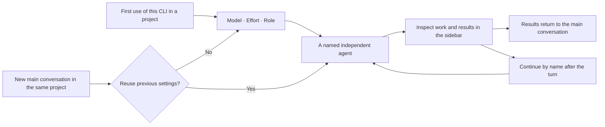

[简体中文](README.md) | **English**

<div align="center">

# CLI Worker Now

**A shared workspace for your AI CLIs inside DeepSeek Harness.**

Choose a CLI, model and role, dispatch a named agent, follow its work in the sidebar, and continue the same task.

[](https://github.com/SuperWheel/cliworker-now/releases/latest)
[](https://github.com/deepseek-ai/deepseek-harness)
[](#4-requirements-and-cli-support)
[](LICENSE)

[Download](https://github.com/SuperWheel/cliworker-now/releases/latest) · [Install](#5-installation-and-updates) · [Get started](#6-using-cli-worker-now) · [Report an issue](https://github.com/SuperWheel/cliworker-now/issues)

</div>

**On this page**

[1. Overview](#1-overview) · [2. Features](#2-features) · [3. Screenshots](#3-features-in-the-interface) · [4. Support](#4-requirements-and-cli-support) · [5. Installation](#5-installation-and-updates) · [6. Usage](#6-using-cli-worker-now) · [7. Permissions and FAQ](#7-permissions-data-and-faq) · [8. Development](#8-development-and-verification) · [9. Documentation](#9-documentation-feedback-and-license)

## 1. Overview

CLI Worker Now is an **independent multi-CLI agent plugin for DeepSeek Harness**. It connects external AI CLIs to the main conversation and right sidebar: the main conversation dispatches work and receives results, while the sidebar holds each agent's tasks, conversation and status.

It is designed for people who already use several AI CLIs and want to manage their work in one place. Each CLI keeps its own account, supported models and native sessions.

- **Development:** ask Codex to review code, then follow up with the same named agent.
- **Writing and editing:** assign separate roles for plot logic, style, commercial review and revision.
- **Longer tasks:** keep execution records and an independent conversation, then continue without restating all the context.

The plugin requires DeepSeek Harness and the CLIs you choose to use. Model access, subscriptions and API billing remain with their respective providers.

## 2. Features

| Feature | How it works | Benefit |
| --- | --- | --- |
| **Several CLIs, one entry point** | Name the CLI in the main conversation; browse tasks grouped by CLI in the sidebar | Find work and results without searching through multiple terminals |
| **Native CLI capabilities** | Each adapter uses its CLI's own arguments, authentication and session protocol | Models and reasoning options follow the actual CLI capabilities |
| **Named agents and reusable roles** | Unique names, role presets, custom instructions and follow-ups by name | Reuse the same reviewer or assistant with a clear responsibility |
| **Execution and results together** | Independent conversations, public tool events, task status and available usage data | See what happened and inspect failures |
| **Explicit selection and scheduling** | Initial model selection, individual CLI switches, stopping, session exclusion and serial writes in the same directory | Keep execution tied to your choices, with no silent CLI fallback |
| **Harness integration** | Native sidebar tabs, question cards, theme and controls; results return to the main conversation | Dispatch, inspect and continue work in the same interface |

These features improve task organization and continuity. The model's quality and each CLI's permission capabilities remain those of the underlying service and tool.

## 3. Features in the interface

The screenshots below were captured in **DeepSeek Harness Desktop 0.2.0-rc.2 with CLI Worker Now v0.6.5**. A separate public demo conversation used Antigravity's `gemini-3.8-flash / low` for a real greeting task.

The current version uses the selected [sky-blue split logo](doc/assets/project-icon/official-v4/README.md). The entry icon is blue; titles use the same silhouette in black or white according to the theme. The screenshots remain historical v0.6.5 examples.

### 3.1 Task overview and agent conversations

Browse agents grouped by CLI and filter running, completed or failed tasks. Open an agent to inspect its independent conversation, public execution events and usage, then continue after the turn finishes.


Select a task card in the right sidebar to enter that agent's conversation. The main conversation and child conversation keep their own records.


### 3.2 Role presets and custom instructions

The settings dialog manages role cards by name and summary. Seven writing roles are included, and you can add roles for development, research or other work. Each agent retains the role snapshot used at creation. Preset edits apply when selecting again and do not change confirmed settings or existing conversations.


### 3.3 CLI connections, accounts and model preferences

Enable each CLI separately and manage its account, project default model and reasoning effort. Supported CLIs can open their native account terminal. Authentication information follows the CLI's actual account source.


### 3.4 Light and dark themes

The plugin follows Harness themes, with expandable cards, hover states, native menus and a fixed-height settings dialog. Animations respect the system's reduced-motion preference. The interface currently uses Chinese labels; this page provides the English documentation.

## 4. Requirements and CLI support

### 4.1 Requirements

| Component | Requirement |
| --- | --- |
| Operating system | **macOS / Windows**; each external CLI needs its native installation for that system |
| Host | **DeepSeek Harness 0.2.0-rc.2** |
| Node.js | **22.19.0 or newer** |
| External CLIs | Install only those you need, with their own account or API access; the OMP npm package needs Bun ≥ 1.3.14 |
| Install command | Enable `dsh` from Desktop’s Manage dsh Command menu; macOS and Windows share the same syntax |
| Source development | pnpm **11.25.0**, as pinned in the repository |

The plugin package and Harness UI are not restricted to macOS. Worker execution uses each CLI's native protection and permission options; the plugin adds no operating-system process sandbox. macOS has live historical acceptance. Windows x64 passed runtime and own-account source tests for all 11 CLIs, plus actual Codex/Pi/OMP startup and Pi SDK metadata checks. Individual CLI installations and live model access remain separate requirements.

### 4.2 Adapter coverage and verification

An integrated adapter does not mean every model, subscription or platform has been tested. The table preserves historical live checks. Account isolation and model permissions were tightened in later releases, so an earlier successful task does not establish current access. No new model-generation tasks were run for this release.

| CLI | Checked version | Verification scope |
| --- | --- | --- |
| Antigravity | 1.2.16 | Live first turn, follow-up and stopping verified |
| Codex | 0.160.0 | Live first turn and continuation of the same native session verified |
| Claude Code | 2.1.176 | Live first turn and follow-up verified; `sonnet` mapped to GLM in that test environment |
| Kimi Code | 2.1.1 | Native token status, account identity and login management checked; an earlier 0.42.0 live request was blocked by subscription HTTP 403; generation has not been repeated |
| Official MiMo Code | 0.1.15 | Live first turn and follow-up verified |
| ZCode | 0.16.9 | Native authentication, headless execution and session protocol integrated; see its probe record |
| Grok Build | 1.0.0 | Own login, official Build access permission and model directory checked separately; generation remains unverified |
| OMP | 16.4.4 | Native login/logout menus and own log-write permissions checked; RPC integrated; Zhipu Coding CN GLM-5.3-Flash was tested historically |
| Pi | 1.0.2 / 1.0.4 | Executable identity and SDK/RPC checked by version; 1.0.2 with Zhipu Coding CN GLM-5.3-Flash was tested historically; 1.0.4 checks were read-only or offline |
| Hermes Agent | Installed checkout 6c80c32734 | Own account directory, native account menus and Nous model access checked; a read-only check returned 10 free models; generation and continuation remain unverified |
| OpenCode | 1.18.21 | Native model directory and JSONL adapter integrated; Zhipu models were tested historically; a free MiMo request previously returned HTTP 403 |

MiMo refers to [XiaomiMiMo/MiMo-Code](https://github.com/XiaomiMiMo/MiMo-Code). Hermes Agent replaced the old external Harness CLI adapter; DeepSeek Harness remains the plugin's host.

Probe records: [ZCode](doc/zcode-probe.md) · [Grok](doc/grok-probe.md) · [Pi / OMP](doc/pi-omp-probe.md) · [Hermes](doc/hermes-probe.md) · [OpenCode](doc/opencode-probe.md)

## 5. Installation and updates

### 5.1 One-line install

```sh
dsh plugin --profile desktop add https://github.com/SuperWheel/cliworker-now/releases/download/v0.6.15/dsh-cliworker-now-0.6.15.tgz
```

<details>
<summary>Web, source installation and updates</summary>

For the Web profile:

```sh
dsh plugin --profile web add https://github.com/SuperWheel/cliworker-now/releases/download/v0.6.15/dsh-cliworker-now-0.6.15.tgz
```

Finish active tasks and fully quit Harness before installation or updates, then reopen it. The release package is prebuilt and needs no manual extraction or compilation. You can also paste the same package URL into the plugin manager's Add Plugin dialog.

For source development:

```sh
git clone https://github.com/SuperWheel/cliworker-now.git
cd cliworker-now
pnpm install --frozen-lockfile
pnpm --config.verifyDepsBeforeRun=false build
dsh plugin --profile desktop add .
```

Source installation links the local checkout, so retain that directory. To uninstall:

```sh
dsh plugin --profile desktop remove dsh-cliworker-now
```

Uninstalling retains local accounts, history and preferences. Each release includes a `SHA256SUMS.txt` checksum file.

</details>

## 6. Using CLI Worker Now

### 6.1 Dispatch your first agent

In a Harness main conversation with a working directory selected, explicitly name the CLI you want to use:

> Use Codex to inspect this project's login error handling. Name the agent “Code Reviewer”.

Short aliases are also supported:

> Use agy CLI to review this project.
>
> Use glm CLI to check this code.

`agy` maps to **Antigravity**, `glm / zhipu / 智谱` to **ZCode**, and `harmes` to **Hermes Agent**. Explicit requests receive a routing hint, and dispatch tools resolve these aliases consistently. A small spelling error in a longer name is accepted only with one unambiguous match. Unknown names or multiple targets return a short error with candidates and do not start a task. Ordinary model discussion, negated requests and quoted examples do not trigger a routing hint. Harness's main model still decides whether to invoke the tool; if needed, explicitly ask it to “use the CLI Worker plugin to call agy CLI”.

The first use of a project and CLI opens a native Harness question card for:

1. **Model:** an available model from that CLI's account-scoped directory.
2. **Reasoning effort:** only options supported by the selected model.
3. **Agent role:** an existing preset, no preset, or temporary instructions entered under “Other”.

The complete model, effort and role choice is saved before the task starts. There are only two kinds of dispatch questions:

- **Select model, reasoning effort and role:** on the first use of that CLI in a project, or after choosing to change settings. Choose a model first, then its supported effort and a role.
- **Reuse previous settings:** on the first invocation in a new main conversation for the same project and CLI. Reuse applies the complete setup; choosing to change it returns to selection.

Later invocations in the same main conversation use its confirmed setup, including after a restart. Cancelling or leaving the selection incomplete does not save partial settings or start a task. Legacy model-and-effort defaults require one complete selection after upgrading.

Each explicit CLI request includes routing guidance in that same model request: call `cliworker_start` to open setup. The plugin collects model, effort and role before launching, so the main model needs no preliminary role or launch questions. Every call must explicitly include `cli`, including Antigravity. A missing selector returns a parameter error instead of using a previous or default CLI. The ordinary question tool remains unchanged.

All 11 CLIs use only their own native login or an API key configured in that CLI's own settings or private `.env`. Selectable models and reasoning efforts are the intersection of CLI capabilities and the current account's available scope. A public catalog, old cache, fixed alias or anonymous free model alone does not establish availability. If access cannot be confirmed, the list stays empty with a short reason. Permission discovery uses read-only metadata, rather than generation requests.

Model menus show readable names without provider prefixes or parenthesized notes, and deduplicate the same native model. Saved choices and execution retain the full route ID. For a new choice, models with confirmed available free allowance appear first; missing prices and default zero-cost metadata are not treated as proof of free access. Existing valid choices remain, and a failed free route never silently becomes a paid request.

**OMP (Oh My Pi) and Pi Coding Agent are separate CLIs.** Their installations, accounts, models and sessions are managed independently. The plugin checks executable identity and does not silently replace an installation with another version.

OMP, Pi, Hermes and OpenCode display their own provider and authentication method. Account logins use a concise label such as `OpenAI账号登录`; full safe identity details and other API sources remain in the hover text. API-only authentication uses a label such as `zai.cn API 登录`. Valid authentication is not reduced to a generic “configured” state; model access is checked separately.

OMP, Pi and Hermes use the same logout button and open their own native logout menus. If more than one own account directory exists, choose the source first. The operation targets that source and preserves others. API keys in Pi/OMP `.env` or model configuration must be managed in their original configuration when native logout cannot remove them. Hermes's native disabled-source state also governs login, model discovery and execution.

Account discovery and execution use the same source. Saving a model choice, starting a task, dequeuing work and continuing a session recheck the account, model and effort. Switching accounts or logging out blocks stale queued work. After an account switch, create a new task; earlier conversations remain available. Older tasks without an account binding also require a new task. Other CLIs' credentials and Harness API credentials are not imported. The legacy `zaiCredentialRef` setting remains readable but has no effect. Derived authentication snapshots are rebuilt from current own sources; invalid preferences require a new selection.

Some account modes have additional boundaries:

- **Antigravity:** uses its own native login and live `agy models` directory, including native effort variants. A slow or failed model query does not turn a logged-in account into “not logged in”. Duplicate in-flight account reads are combined; refresh and execution still read current authentication.
- **Codex:** supports checked official file-based accounts. Keyring accounts or custom routes remain unavailable when account scope cannot be established.
- **Claude, Kimi and OpenCode:** unsupported OAuth model-discovery modes currently show an empty model list. Own API configurations are filtered by account scope. OpenCode OAuth writeback lacks account-version protection, so only its own API configuration is currently enabled for execution.
- **MiMo:** its native browser login writes own API authentication, including the official service address. Only verifiable local configuration is accepted; file/environment interpolation or remote organization configuration must first be removed.
- **Kimi identity:** a valid or renewable native login displays “logged in” and a confirmed shortened account ID. Email addresses or names are not invented when the native account does not store them. “Manage login” opens the native terminal; enter `/logout` and then `/login` to switch accounts. It starts in an empty directory without project MCP configuration. Native trust prompts remain user decisions. Provider configuration without a token does not count as a login.
- **Hermes:** explicitly opening login settings establishes its isolated native account directory inside the plugin. Status, models and tasks then remain bound to it; logout does not fall back to an older global account. Host account discovery excludes credentials borrowed from other CLIs and never injects Harness authentication. The native process follows its own permissions. Nous models come from the authenticated official directory and access permissions; only confirmed free models are offered without paid access. Discovery does not refresh or generate. Authentication that does not meet native execution's remaining-lifetime requirement asks for login again.
- **Grok:** checks the official Build access gate before matching the authenticated directory with native models and efforts. Login, an HTTP 200 catalog response or subscription status alone does not establish execution permission. Unknown or denied access leaves the model list empty with a short reason.



### 6.2 Inspect, stop and continue

- Open a task card to enter its conversation. Returning to the overview preserves an unsent draft.
- Stop a running task from its conversation. Stopping is reported only after managed processes exit.
- After a turn finishes, send the next step in the child conversation or tell the main conversation: **“Ask Code Reviewer to continue checking test coverage.”**
- Follow-ups by name stay within the current main conversation and reuse the same CLI session. Renaming preserves history and the role.
- Closing the sidebar does not stop background work; completed results still return to the main conversation.

### 6.3 Manage roles and CLIs

| Setting | What you can change | Scope |
| --- | --- | --- |
| Agent settings | Add, edit or remove name / summary / instruction presets | Shared in the current Harness profile; existing agents keep their original role snapshot |
| CLI connections | Enable a CLI, refresh status, manage or switch accounts, open the native account terminal | That CLI; finish its tasks and account terminals before disabling it |
| Project defaults | Save the default model and reasoning effort | New main conversations in the current project and CLI; confirmed conversations keep their setup |
| Child-conversation model menu | Change an agent's model or effort after a turn | Next continuation, retaining the same native session |

Included roles: **commercial reviewer, logic reviewer, style reviewer, prose reviser, plot-beat designer, story-structure planner and lead novelist**. See [default role presets](doc/role-presets.md) for their instructions.

| Status dot | Meaning |
| --- | --- |
| Gray | Not installed, not logged in, ordinary configuration only, or not checked yet; checking displays a loading state |
| Red | Known expired login, damaged configuration, read failure, invalid explicit executable path, or failed catalog discovery for a configured CLI |
| Green | Logged in, based on native state, a renewable login session, or an exact current-account credential binding |

An empty model directory for an unconfigured CLI stays gray. Account reads finish before model loading. Refreshing authentication or finishing an account operation invalidates and reloads the model list. Stale models cannot be selected while a refresh is pending or after it fails. Stored defaults remain for rechecking. The navigation dot and account summary use the same status rules; the account section keeps necessary information on one line.

## 7. Permissions, data and FAQ

### 7.1 Execution and data

- **Explicit execution:** a missing or failed CLI does not trigger fallback to another CLI. The plugin does not take over independently started CLI processes.
- **Scheduling:** two concurrent tasks by default, one active turn per native session, and serial write tasks in the same directory. The hierarchy is main conversation → direct child agent. Running-task interjections and recursive dispatch are not supported.
- **Permissions:** Harness planning mode or read-only host permissions prevent task startup. Once execution is allowed, supported CLIs can receive read-only tasks. Kimi and Hermes noninteractive modes do not support read-only dispatch and are rejected for such tasks. See probe documents for native CLI permission and tool capabilities.
- **Local records:** plugin records live under `$DSH_HOME/cliworker-now`, normally `~/.dsh/cliworker-now`. On POSIX systems, directories use `0700` and files `0600`. External CLIs still send model requests according to their services and configuration.
- **Sourced usage:** only CLI-reported or verifiable statistics are shown; unavailable values display `—`. Context usage is distinct from cumulative token usage. Antigravity's estimate source is explained in the details.
- **Own accounts:** valid native sessions display green; own API configuration identifies its source, and models are scoped to the account. API keys are not displayed. Some account sources are shared with native terminals, so logging out can affect that CLI in other terminals.

### 7.2 FAQ

<details>
<summary><strong>Why can Desktop not find a CLI installed in my terminal?</strong></summary>

Desktop may have a different executable search path from your terminal and does not load shell startup files such as `.zshrc`. The plugin checks common installation locations. If discovery still fails, set that CLI's absolute executable path in plugin configuration. See [configuration and version notes](doc/version-notes.md).

</details>

<details>
<summary><strong>Why does the model menu fail or show HTTP 404 after an update?</strong></summary>

Finish active tasks, close Harness completely and reopen it. Refreshing the plugin list can leave an older Host paired with a newer Client. If the issue persists after restarting, check the CLI installation, account and native model directory.

</details>

<details>
<summary><strong>Does every CLI require a subscription? Why can a logged-in account fail?</strong></summary>

Subscriptions, API billing and model permissions are set by each provider. A login page, local account record or model directory does not establish every model's request permission. For HTTP 403 and similar errors, check the native account's access rights.

</details>

<details>
<summary><strong>Why are there no reasoning-effort options or context percentage?</strong></summary>

Only explicitly supported effort options are offered. Without that capability, the CLI's configuration applies. Unavailable context measurements display `—`; they are not guessed from a model name or cumulative usage.

</details>

## 8. Development and verification

The project uses **TypeScript ESM and React**. The Host manages processes and persistence; the Client accesses it through Harness's native Gateway, with shared protocol definitions between them.

```sh
pnpm install --frozen-lockfile
pnpm --config.verify-deps-before-run=false typecheck
pnpm --config.verify-deps-before-run=false test
pnpm --config.verify-deps-before-run=false build:preview
```

The isolated package is written to `.cache/preview-package`. Verify it in a separate profile first, then check that no tasks are active before the production build, so development does not overwrite the version used by an active Desktop session.

Live CLI acceptance is separate and uses the selected account's model allowance:

```sh
pnpm --config.verify-deps-before-run=false smoke:extended --help
```

v0.6.15 passed type checking, 1,112 local regression tests and actual Windows runtime checks. See the [Windows workflow](https://github.com/SuperWheel/cliworker-now/actions/workflows/windows.yml). Runtime checks do not establish live model access; historical model verification is listed in section 4 and [verification records](doc/tasks.md).

Development changes use **OpenSpec** proposals, delta specifications and tasks. Specifications are expanded as their areas change, while design decisions and acceptance history are retained. The project pins its OpenSpec dependency:

```sh
pnpm spec:list
pnpm spec:check
```

In Codex, use `openspec-propose` to prepare a change, `openspec-apply-change` to implement it, and `openspec-archive-change` after verification. See the [OpenSpec development guide](doc/openspec.md). Plugin users do not need OpenSpec.

## 9. Documentation, feedback and license

- [Design and protocol](doc/design.md): architecture, scheduling, permissions and persistence.
- [OpenSpec development guide](doc/openspec.md): planning, implementation, verification and archiving.
- [Tasks and verification records](doc/tasks.md): implemented work and actual checks.
- [Version history and configuration](doc/version-notes.md): releases, adapter settings and limitations.
- [Role presets](doc/role-presets.md): built-in roles and their boundaries.
- [Screenshot sources and privacy](doc/assets/readme/README.md): the origin of the public screenshots.
- [Report an issue](https://github.com/SuperWheel/cliworker-now/issues): include Harness / plugin / CLI versions, reproduction steps and redacted logs. Keep account tokens and private project content out of reports.

This independent community plugin uses the [MIT License](LICENSE). DeepSeek Harness and CLI names, icons and trademarks belong to their respective owners; no official affiliation or endorsement is implied.
