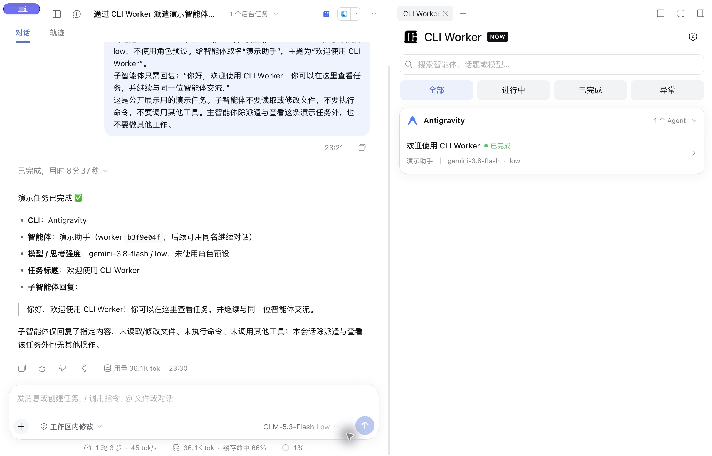
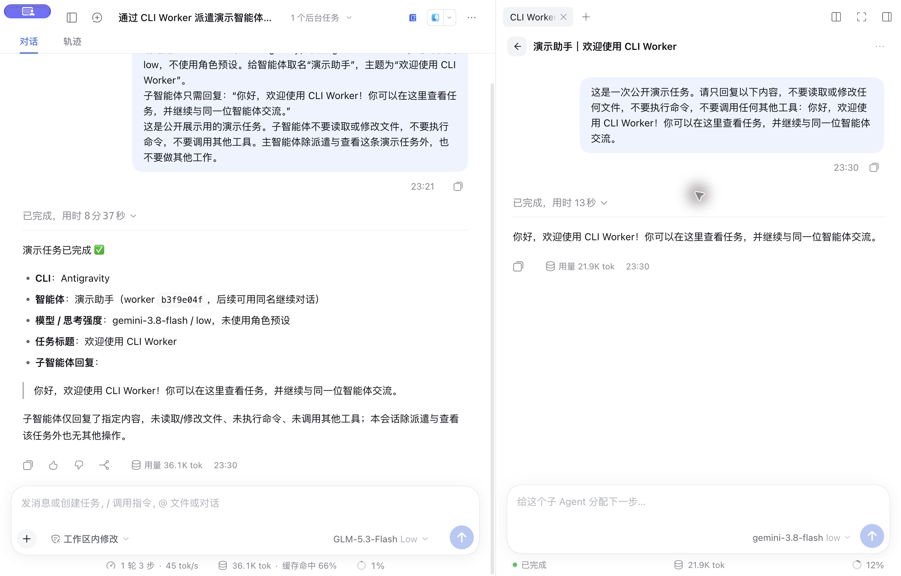
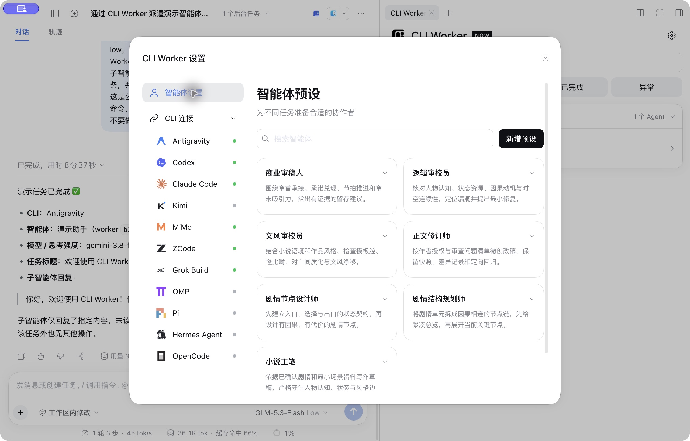
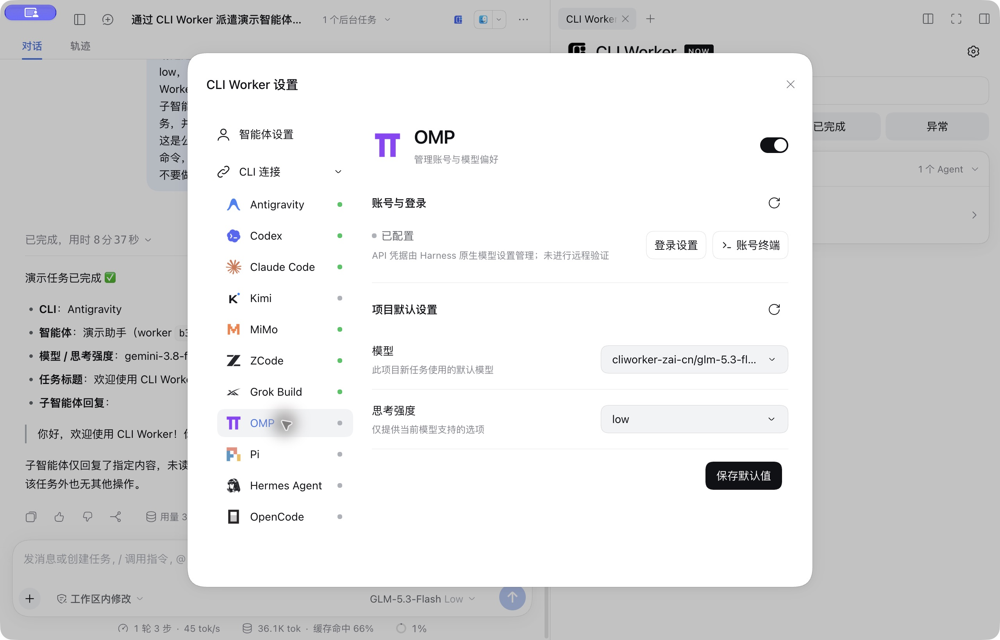
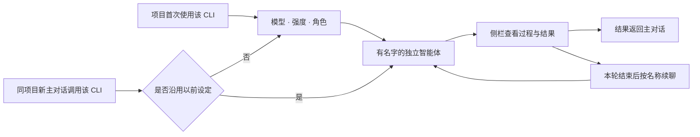

<div align="center">

# CLI Worker Now

**简体中文** | [English](README.en.md)

**在 DeepSeek Harness 里，给不同 CLI 一个共同的协作空间。**

选择 CLI、模型和角色，派出有名字的智能体；在侧栏查看过程、接收结果，并继续同一个任务。

[](https://github.com/SuperWheel/cliworker-now/releases/latest)
[](https://github.com/deepseek-ai/deepseek-harness)
[](#4-环境与-cli-支持)
[](LICENSE)

[下载安装包](https://github.com/SuperWheel/cliworker-now/releases/latest) · [安装方法](#5-安装与更新) · [开始使用](#6-使用方法) · [反馈问题](https://github.com/SuperWheel/cliworker-now/issues)

</div>

**阅读导航**

[1. 项目定位](#1-项目定位) · [2. 特点与优势](#2-特点与优势) · [3. 界面效果](#3-功能与界面效果) · [4. 支持范围](#4-环境与-cli-支持) · [5. 安装更新](#5-安装与更新) · [6. 使用方法](#6-使用方法) · [7. 常见问题](#7-权限数据与常见问题) · [8. 开发验证](#8-开发与验证) · [9. 文档与反馈](#9-文档反馈与许可)

## 1. 项目定位

CLI Worker Now 是 **DeepSeek Harness 的独立多 CLI 智能体插件**。它把分散在终端中的外部 AI CLI，接入 Harness 的主对话和右侧栏：主对话负责派遣与接收结果，侧栏负责展示各个智能体的任务、对话和状态。

适合已经使用多个 AI CLI，希望集中管理任务、反复调用同一位助手的人。你仍然使用各 CLI 自己的账号、模型与原生会话，插件负责把这些工作组织起来。

- **开发协作**：指定 Codex 审查代码，再按同一个智能体名称继续追问。
- **小说创作与审校**：为逻辑、文风、商业审稿和正文修订配置不同角色。
- **长任务跟进**：保留独立对话和执行记录，任务结束后继续，不必重新描述全部背景。

> 插件依赖 DeepSeek Harness 和相应 CLI；不附带模型服务、订阅或 API 额度。CLI 的模型请求由各自服务商处理。

## 2. 特点与优势

| 特点 | 如何实现 | 带来的价值 |
| --- | --- | --- |
| **一个入口，多种 CLI** | 在主对话点名 CLI，在同一侧栏按 CLI 分组查看任务 | 减少在多个终端之间查找任务和结果的切换 |
| **保留原生能力** | 不同 CLI 使用各自的参数、登录与会话协议，模型目录按实际能力读取 | 可以继续使用熟悉的 CLI 生态；模型和强度不会被硬套成一套规则 |
| **智能体有名字、有角色** | 唯一名称、角色预设、自定义提示词，以及按名称续聊 | 同一位审校员或开发助手可以反复调用，职责更清楚 |
| **过程与结果放在一起** | 独立对话、公开工具事件、任务状态，以及 CLI 实际提供的用量 | 能看到任务走到哪一步，出错后有记录可查 |
| **明确选择，可控调度** | 首次选型、每个 CLI 独立开关、停止操作；同会话互斥、同目录写任务串行 | 任务按明确的选择执行；失败时不会悄悄换用另一个 CLI |
| **融入 Harness 工作流** | 复用宿主的侧栏、问题卡片、主题与控件，完成结果回到主对话 | 派遣、查看、继续和收尾都在熟悉的界面中完成 |

这些优势侧重于**任务组织、上下文延续和操作体验**。插件不承诺提升模型本身的准确率，也不把不同 CLI 的权限能力视为完全相同。

## 3. 功能与界面效果

以下效果图均直接拍摄于 **DeepSeek Harness Desktop 0.2.0-rc.2 + CLI Worker Now v0.6.5**。为公开展示新建了独立演示会话，使用 Antigravity 的 `gemini-3.8-flash / low` 真实执行一条欢迎语任务。

当前版本使用用户选定的[天蓝平切 Logo](doc/assets/project-icon/official-v4/README.md)：入口使用原彩色图，标题随浅色／深色主题显示相同轮廓的黑／白版。下面的历史截图仍为 v0.6.5。

### 3.1 任务总览与独立对话

按 CLI 分组查看智能体，筛选进行中、已完成和异常任务。进入某个智能体后，可以查看独立对话、公开执行记录和用量，在本轮结束后继续交流。



点击右侧任务卡片，进入这位智能体的独立对话。主对话和子对话各自保留记录。



### 3.2 角色预设与自定义提示词

设置页以“名称 + 概述”的卡片管理角色。内置七种小说创作角色，也可新增适用于开发、研究或其他任务的角色。每个智能体保留创建时的角色副本；修改预设在重新选型时生效，不改变已确认设定或已有对话。



### 3.3 CLI 连接、账号与模型偏好

每个 CLI 可以单独开启或关闭，分别管理账号、项目默认模型与思考强度。支持的 CLI 可直接打开原生账号终端；登录状态与账号来源按各 CLI 的实际能力显示。



### 3.4 亮暗主题与交互

跟随 Harness 的亮暗主题，保留卡片展开收起、按钮悬停、原生菜单和固定高度设置弹窗；系统启用“减少动态效果”时相应停用动画。


## 4. 环境与 CLI 支持

### 4.1 环境要求

| 项目 | 要求 |
| --- | --- |
| 操作系统 | **macOS / Windows**；外部 CLI 需安装对应系统的原生版本 |
| 宿主 | **DeepSeek Harness 0.2.0-rc.2** |
| Node.js | **≥ 22.19.0** |
| 外部 CLI | 按需安装，并准备该 CLI 自己的登录或 API 配置；OMP 的 npm 版本需 Bun ≥ 1.3.14 |
| 安装命令 | 在 Desktop 菜单“管理 dsh 命令…”中启用 `dsh`，macOS 与 Windows 使用相同命令 |
| 源码开发 | pnpm **11.25.0**，以仓库锁文件为准 |

### 4.2 支持范围与验证边界

插件使用各 CLI 原生的保护和权限模式，不再附加操作系统进程沙箱。Windows x64 已通过运行层和 11 个 CLI 的账号来源测试，并实测 Codex/Pi/OMP 启动及 Pi SDK 元数据；下表区分接入版本与实际模型调用记录。模型列表只展示当前 CLI 自身账号可用的选项。

| CLI | 已核验版本 | 当前验证范围 |
| --- | --- | --- |
| Antigravity | 1.2.16 | 首轮、续聊与停止已有真实验收 |
| Codex | 0.160.0 | 真实首轮与同会话续聊通过 |
| Claude Code | 2.1.176 | 真实首轮与续聊通过；测试环境的 `sonnet` 映射到 GLM |
| Kimi Code | 2.1.1 | 原生令牌状态及登录管理入口已修复；此前 0.42.0 真实请求被订阅权限 403 阻止，本轮未重新生成 |
| 官方 MiMo Code | 0.1.15 | 真实首轮与续聊通过 |
| ZCode | 0.16.9 | 原生登录、headless 与会话协议已接入；详见专项记录 |
| Grok Build | 1.0.0 | 自身登录、官方 Build 访问许可和模型目录分别核对；目录可读不等于有调用权限，真实生成未验收 |
| OMP | 16.4.4 | 原生登录菜单及自身日志写权限已修复；RPC 接入，历史智谱 Coding CN GLM-5.3-Flash 已实测 |
| Pi | 1.0.2 / 1.0.4 | 原生安装身份及 SDK/RPC 按版本核验；1.0.2 的智谱 Coding CN GLM-5.3-Flash 曾实测，1.0.4 本轮仅只读/离线核验 |
| Hermes Agent | 当前安装 checkout 6c80c32734 | 独立自身账号目录、原生登录菜单及 Nous 自身账号目录已验收；只读确认 10 个免费模型，真实生成与续聊未验收 |
| OpenCode | 1.18.21 | 原生目录与 JSONL 接入；智谱模型已实测，免费 MiMo 请求曾返回 403 |

MiMo 指 [XiaomiMiMo/MiMo-Code](https://github.com/XiaomiMiMo/MiMo-Code)。Hermes Agent 替代的是旧的外部 Harness CLI 入口，**DeepSeek Harness 宿主仍是插件的运行基础**。

专项记录：[ZCode](doc/zcode-probe.md) · [Grok](doc/grok-probe.md) · [Pi / OMP](doc/pi-omp-probe.md) · [Hermes](doc/hermes-probe.md) · [OpenCode](doc/opencode-probe.md)

## 5. 安装与更新

### 5.1 一行安装

```sh
dsh plugin --profile desktop add https://github.com/SuperWheel/cliworker-now/releases/download/v0.6.15/dsh-cliworker-now-0.6.15.tgz
```

<details>
<summary>Web、源码安装与更新</summary>

使用 Web profile 时：

```sh
dsh plugin --profile web add https://github.com/SuperWheel/cliworker-now/releases/download/v0.6.15/dsh-cliworker-now-0.6.15.tgz
```

安装或更新前先结束活动任务并完整退出 Harness，完成后重新打开。预构建包无需手动解压或编译。也可以在插件页“添加插件”中粘贴同一安装包 URL。

从源码开发：

```sh
git clone https://github.com/SuperWheel/cliworker-now.git
cd cliworker-now
pnpm install --frozen-lockfile
pnpm --config.verifyDepsBeforeRun=false build
dsh plugin --profile desktop add .
```

源码安装会链接本地目录，因此该目录需要保留。卸载使用：

```sh
dsh plugin --profile desktop remove dsh-cliworker-now
```

卸载保留本机账号、历史会话和偏好。每个 Release 提供 `SHA256SUMS.txt` 校验文件。

</details>

## 6. 使用方法

### 6.1 首次派遣

在已选工作目录的 Harness 主对话里，明确说出要使用的 CLI，例如：

> 用 Codex 检查这个项目的登录错误处理，把这个智能体命名为“代码审查员”。

也可以使用简称或别名（本地 v0.6.7 起）：

> 调用 agy cli 帮我审查这个项目。
>
> 调用 glm cli 帮我检查这段代码。

`agy` 对应 **Antigravity**，`glm / zhipu / 智谱` 对应 **ZCode**，`harmes` 对应 **Hermes Agent**。插件会为当前明确调用提供路由提示，并在派遣工具里统一解析名称；较长名称的轻微拼写误差只有唯一候选时才接受。未知名称或多个目标返回简短错误和候选，不自动派遣，普通模型讨论、否定调用和引用示例不会触发路由提示。是否调用工具仍由 Harness 主模型决定；如果模型忽略请求，可明确说“使用 CLI Worker 插件调用 agy CLI”。

首次使用相应项目和 CLI 时，通过 Harness 原生问题卡片选择：

1. **模型**：来自该 CLI 的实际目录。
2. **思考强度**：仅提供当前模型支持的选项。
3. **智能体预设**：选择已有角色、不使用预设，或在“其他”里写临时提示词。

模型、强度和角色全部确认后，才保存设定并启动任务。只会出现两类询问：

- **选择模型、思考强度和角色**：项目中首次使用该 CLI，或选择重新设置时出现。先选模型，再选择它支持的强度和角色。
- **是否沿用以前的设定**：同项目、同 CLI 的新主对话首次调用时出现；沿用即使用整套设定，重新选择则回到选型。

同一主对话之后的调用直接使用已确认设定，重启后也不会重复询问。取消或未完整回答不保存半套设定、不启动任务。旧版只保存模型和强度的偏好，升级后首次需补全整套选择。

明确调用 CLI 时，当前请求会携带对应 CLI 的派遣指引：直接调用 `cliworker_start` 打开选型，模型、强度和角色由插件收集，选型完成后才启动任务。每次工具调用必须显式传入 `cli`（Antigravity 也一样）；漏传会返回参数错误，不会采用上次调用或默认 CLI。主模型无需预先提问角色或确认启动；通用提问工具保持不变。

全部 11 个 CLI 只使用自身原生登录，或在该 CLI 自己的配置／私有 `.env` 中单独设置的 API Key。模型与强度只展示“本 CLI 支持”与“当前自身账号可用范围”的交集；公共目录、旧缓存、固定别名和匿名免费模型不能单独成为可选依据。无法确认时显示空列表及简短原因。账号范围使用只读模型查询，不通过生成请求试探权限。

设置、模型菜单和任务卡片只显示模型名称，删除服务商前缀及括号附注；同一原生模型去重，保存和执行仍使用完整路由 ID。新选择优先有明确证据且可用的免费额度，缺省零成本和价格未知不当免费。有效的既有选择保持不变，首次使用仍须由你选型，免费路由失败也不会自动转为付费请求。

OMP（Oh My Pi）与 Pi Coding Agent 是两个独立 CLI；安装、账号、模型和会话各自管理，即使使用相同模型也不能互换。插件核验实际执行程序身份；Pi 优先使用已核验的原生安装，不暗中切换到另一旧版。

OMP、Pi、Hermes 和 OpenCode 的账号行按自身认证显示服务商及方式。有账号登录时简写为“OpenAI账号登录”等，完整安全身份及其他 API 认证保留在悬浮详情；仅 API 时显示“zai.cn API 登录”等。有效认证不会统一降成“已配置”。只有配置声明、缺失或失效凭据保留对应灰/红状态，模型权限仍单独核对。

OMP、Pi 和 Hermes 的“退出”使用统一按钮并打开各自原生退出菜单。多个自身账号目录先选择来源；操作针对所选真实来源，其他来源保留。Pi/OMP 原生退出不能删除的 `.env` 或模型配置内 API，需在原配置中管理。Hermes 原生写入的停用来源会同步约束登录、模型和调用，不从保留的配置值恢复账号。

账号发现和执行绑定同一来源；保存选型、新任务、排队出队和续聊都会重新核对账号、模型与强度。换号或退出会阻止旧任务启动，历史任务换号后需新建任务；升级前未记录账号绑定的历史任务也需新建，原对话保留。插件不读取其他 CLI 的凭据，也不继承 Harness API 凭据；旧 `zaiCredentialRef` 配置兼容读取但不生效。旧派生认证快照会按当前自身来源重建，原生账号、历史会话和偏好保留；失效偏好需重新选择。

Antigravity 使用自身原生登录和实时 `agy models` 目录，只展示原生返回的模型及强度变体。账号读取先完成，模型查询的等待或失败不会把已登录账号改为未登录。重复的在途账号读取会合并，后续刷新与执行授权仍读取当前账号。

当前账号范围边界：Claude／Kimi 的未支持 OAuth 模式及 OpenCode OAuth 暂显示空列表。Claude 自身设置中的 API Key、Kimi 自身 API 配置、MiMo 原生网页登录写入的自身 API 认证，以及可核对的本地配置，按账号列表筛选；保留网页登录附带的官方服务地址。Codex 支持已核验的官方文件账号路径，keyring 或自定义路由缺少范围证据时不放行。MiMo 目前只接受可核验的本地配置，文件／环境插值和远程组织配置需先移除。OpenCode 原生 OAuth 写回缺少账号版本保护，暂只开放自身 API 配置。

Kimi 已有有效或可续期的自身原生登录时显示“已登录”及可确认的简短账号 ID；原生未保存邮箱或昵称时不编造，点击“管理登录”打开原生终端；切换账号由用户输入 `/logout` 后再输入 `/login`。账号终端使用独立空目录，不加载用户项目 MCP；原生若显示 Trust 提示，由用户自行确认。只有提供商配置而没有对应令牌时显示未登录，不会自动退出原账号。

Hermes 首次明确打开登录设置后使用插件内独立原生账号目录，自动导入关闭，状态、模型、任务统一绑定该目录；之后退出不会回退到全局旧账号。原全局账号和历史保留，Host 不把其他 CLI 导入凭据作为自身登录证据，不注入 Harness 认证；原生进程按自身权限运行。现有官方安装的已选依赖环境可直接复用，账号操作不触发重新安装。

Hermes 的 Nous 登录按当前原生授权识别，模型来自该账号认证的官方目录及访问权限；无付费权限时仅开放明确免费的可用模型。目录查询不自动续期或生成，当前认证不足原生执行所需的有效期时提示重新登录；不会用旧快照恢复账号。

Grok 先核对自身官方 Build 访问门禁，再读取认证模型目录并匹配原生模型及强度能力；登录成功或目录 HTTP 200 均不能单独证明调用权限。是否有付费订阅也不能代替服务端门禁结果；未知或拒绝时保持空列表和简短原因，不通过生成请求试探。



### 6.2 查看、停止与继续

- 点击任务卡片进入独立对话；返回总览不会清空未发送的草稿。
- 运行中可以停止任务；插件等待受管理的进程退出后再报告停止。
- 子对话使用与 Harness 主聊天一致的返回最新圆形按钮和历史功能条淡入淡出；最新消息功能条保持可见，历史条在悬停或键盘聚焦时出现。
- 子对话输入框按 Enter 发送、Shift+Enter 换行，支持 Ctrl/Cmd+Enter，中文输入法确认不会误发送。
- 本轮结束后，在子对话输入下一步，或在主对话中说：**“让代码审查员继续检查测试覆盖。”**
- 按名称续聊限定在当前主会话内，复用同一个 CLI 会话；重命名不会清空历史或改变角色。
- 关闭侧栏不会停止后台任务，完成结果仍会回到主对话。

### 6.3 管理角色与 CLI

| 设置入口 | 可以做什么 | 生效范围 |
| --- | --- | --- |
| 智能体设置 | 新增、编辑、删除“名称 / 概述 / 角色提示词”预设 | 当前 Harness profile 共用；已有智能体保留原角色副本 |
| CLI 连接 | 独立开关、刷新状态、登录设置或切换账号、打开原生账号终端 | 对应 CLI；关闭前需先结束其任务与账号终端 |
| 项目默认设置 | 保存默认模型与思考强度 | 当前项目 + 当前 CLI 的新主对话；已确认对话保持原设定 |
| 子对话模型菜单 | 在本轮结束后修改当前智能体的模型或强度 | 下一轮续聊，保留同一个 CLI 会话 |

内置角色：**商业审稿人、逻辑审校员、文风审校员、正文修订师、剧情节点设计师、剧情结构规划师、小说主笔**。更多说明见 [默认角色预设](doc/role-presets.md)。

CLI 连接的状态点含义：

| 状态点 | 含义 |
| --- | --- |
| 灰色 | 未安装、未登录、仅有普通配置或尚未检查；检查中显示加载状态 |
| 红色 | 已知登录失效、配置损坏、读取失败、无效的显式执行路径或已配置后的模型目录失败 |
| 绿色 | 已登录：来自原生状态、可续用登录会话或当前账号的精确凭据绑定 |

未配置 CLI 的空模型目录保持灰色。账号查询结束后再加载模型；刷新账号或结束账号操作会使旧模型清单失效并重新查询。模型刷新中或失败后不能继续选择旧列表，已有项目默认设置保留，恢复后需重新核对。导航与账号摘要使用相同状态规则。账号区仅保留一行状态与必要身份，错误显示简短原因。

## 7. 权限、数据与常见问题

### 7.1 执行与数据边界

- **按明确选择执行**：CLI 缺失或失败时不会自动换用另一个 CLI；不接管在插件外启动的 CLI。
- **调度有边界**：默认两个并发；同一 CLI 会话单轮互斥，同一目录的写任务串行。仅支持主对话 → 直接子智能体两层结构，不支持运行中插话或递归派遣。
- **权限按原生能力处理**：Harness 规划模式或只读权限下拒绝启动。允许执行后，支持的 CLI 可按只读任务模式派遣；Kimi 和 Hermes 非交互模式不支持只读派遣。插件不附加 OS 沙箱，各 CLI 的原生权限与工具限制见专项文档。
- **记录保存在本机**：默认位于 `$DSH_HOME/cliworker-now`（通常为 `~/.dsh/cliworker-now`），POSIX 系统中目录权限 `0700`、文件 `0600`。外部 CLI 仍会按自己的服务与配置发送模型请求，不能据此认为任务完全离线。
- **用量有来源**：只展示 CLI 提供或可核查的统计，缺失显示 `—`；上下文占用与累计 Token 不是同一指标。Antigravity 的估算来源会在详情中说明。
- **账号有边界**：原生已登录会话正确显示绿色；自身 API 配置单独标记，模型权限按当前账号筛选。插件不在页面展示 API 密钥；部分 CLI 与原生终端共用账号，退出操作可能同时影响该 CLI 的其他终端。

### 7.2 常见问题

<details>
<summary><strong>已经在终端安装了 CLI，为什么 Desktop 找不到？</strong></summary>

Desktop 不会读取你的 `.zshrc`。插件会识别部分常见安装位置；仍找不到时，在插件配置中设置对应 CLI 的可执行文件绝对路径。可用配置项见 [详细配置与版本说明](doc/version-notes.md)。

</details>

<details>
<summary><strong>模型菜单报错或更新后出现 HTTP 404，怎么办？</strong></summary>

先结束运行中的任务，然后完整退出并重新打开 Harness。只刷新插件列表，可能留下旧 Host 与新 Client，导致接口不一致。重新启动后仍失败，再检查该 CLI 的安装、账号和原生模型目录。

</details>

<details>
<summary><strong>每个 CLI 都需要订阅吗？已登录为什么仍然失败？</strong></summary>

订阅、API 计费和模型权限由各 CLI 的服务商决定。能够打开登录页、读取本地账号或列出模型，不代表对应模型请求一定可用；遇到 403 等错误需核对原生账号权限。

</details>

<details>
<summary><strong>为什么没有思考强度选项或上下文百分比？</strong></summary>

插件只提供 CLI 明确支持的强度。未提供能力时沿用 CLI 配置；未提供可核查上下文数据时显示 `—`，不会根据模型名称或累计用量猜测。

</details>

## 8. 开发与验证

项目使用 **TypeScript ESM + React**：Host 管理进程与持久化，Client 通过 Harness 原生 Gateway 访问 Host，共享协议负责两侧的数据约定。

```sh
pnpm install --frozen-lockfile
pnpm --config.verify-deps-before-run=false typecheck
pnpm --config.verify-deps-before-run=false test
pnpm --config.verify-deps-before-run=false build:preview
```

隔离包输出到 `.cache/preview-package`。先在隔离 profile 验收，确认没有活动任务后，再运行正式构建；避免开发构建影响 Desktop 正在使用的版本。

真实 CLI 验收是额外步骤，会使用对应账号与模型额度，不由以上自动测试代替：

```sh
pnpm --config.verify-deps-before-run=false smoke:extended --help
```

v0.6.15 通过类型检查、1112 项本机回归及真实 Windows 运行层检查；Windows CI 的源码与日志可从 [验证工作流](https://github.com/SuperWheel/cliworker-now/actions/workflows/windows.yml) 查看。各 CLI 的真实验收范围请看第 4 节和 [实际验证记录](doc/tasks.md)。

开发变更使用 **OpenSpec** 管理方案、增量规格与任务；按变更逐步补齐规格，保留现有设计和验收历史。依赖已固定在项目中，安装后可运行：

```sh
pnpm spec:list
pnpm spec:check
```

Codex 中选择 `openspec-propose` 技能准备方案，再用 `openspec-apply-change` 实施；完成验证后用 `openspec-archive-change` 归档。具体命令、文档分工及其他 CLI 的接入见 [OpenSpec 开发指南](doc/openspec.md)。OpenSpec 是本仓库的开发工具，插件使用者无需安装。

## 9. 文档、反馈与许可

- [设计与协议](doc/design.md)：架构、调度、权限与持久化设计。
- [OpenSpec 开发指南](doc/openspec.md)：需求到实施、验证与归档的工作流。
- [任务与实际验证](doc/tasks.md)：已实施内容和验收记录。
- [历史版本与详细配置](doc/version-notes.md)：逐版本变更、适配器配置及限制。
- [角色预设](doc/role-presets.md)：默认智能体的职责与边界。
- [效果图来源与隐私处理](doc/assets/readme/README.md)：原生截图来源与隐私说明。
- [提交 Issue](https://github.com/SuperWheel/cliworker-now/issues)：请附 Harness / 插件 / CLI 版本、复现步骤与已脱敏日志；不要上传账号令牌或私人项目内容。

项目采用 [MIT License](LICENSE)，是独立社区插件。DeepSeek Harness 及各 CLI 的名称、图标和商标归各自权利人所有，不表示官方关联或背书。
