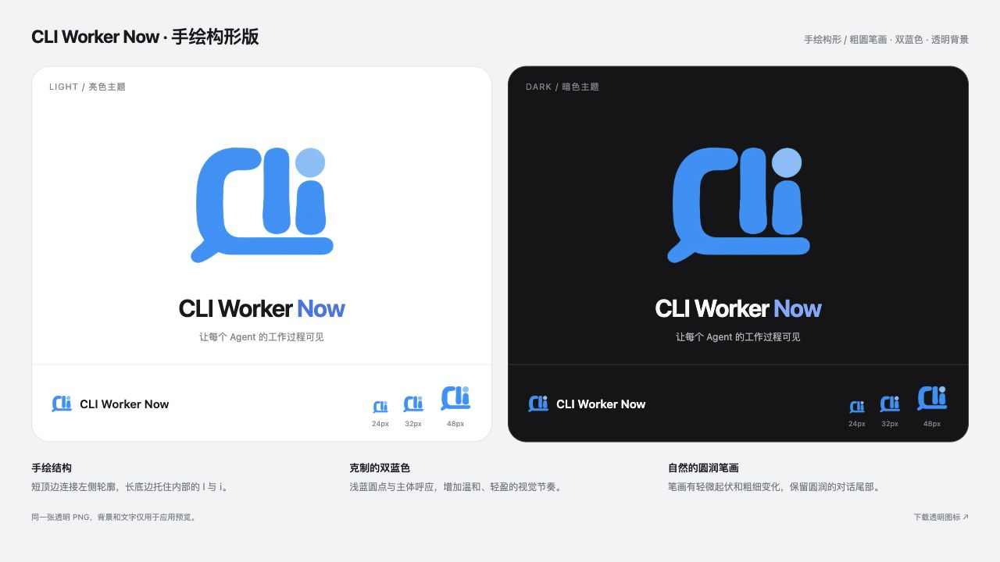

# CLI Worker Now · 手绘构形版

以用户提供的橙色手绘草图为结构依据，以第二张蓝色 Logo 为配色和风格依据，使用内置 image_gen 重绘。

- 保留短顶边、连续左侧轮廓和贯穿 l／i 下方的长底边。
- 保留左下对话尾部，内部笔画采用粗圆轮廓和轻微自然起伏。
- 主体明亮蓝色，i 的独立圆点为浅蓝色，背景透明。

[透明原图](cliworker-now.png) · [预览页面](preview.html) · [检查记录](verification.json)

原图为 1254 × 1254 RGBA PNG，生成后原样复制，没有使用脚本修改像素。已核验透明通道，并在浏览器查看明暗背景及 24／32／48px 图标槽；小尺寸下 i 与底边的间隙较窄。本版为设计候选，尚未替换插件图标，不视为矢量成品验收。

本轮只新增此素材目录，未修改业务代码或安装版本，未运行业务测试。
